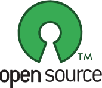
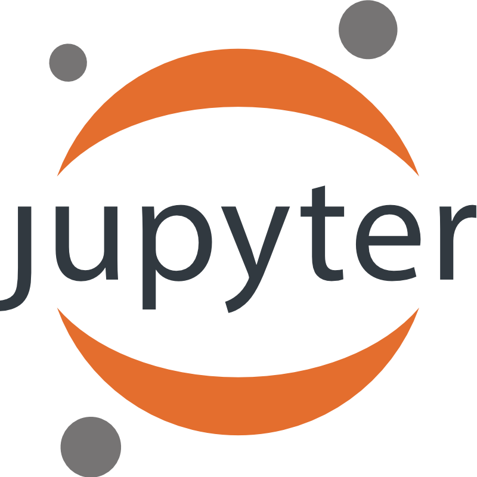

## Program the robot

In this section we will present the different options to program your robot ranging from the high level behaviours triggered using [Snap!](#using-snap), the visual programming language, to the low-level API written in [Python](#using-python).

We will also say a few words on how you can interface Poppy robots with other devices or any programming language using [Poppy's REST API](#through-the-rest-api).

**Note: As for the rest of the project, all our libraries are open source and available on [GitHub](https://github.com/poppy-project).**





### Using Snap!
<!-- TODO: Didier -->

### Using Python


Poppy libraries have been written in Python, to allow for fast development and extensibility and to benefit from all scientific libraries existing. Python is also a well-known language and widely used in education or artistic fields. By programming Poppy in Python, you will have access from the very low-level API to the higher levels.

The API has been designed to allow for very fast prototyping. In particular, creating a robot and starting to move motors should not take more than a few lines:

```python
from poppy.creatures import PoppyErgoJr

jr = PoppyErgoJr()
jr.m3.goal_position = 30
```
<!-- Note: "Notebook documents" or “notebooks”, all lower case -->
We are also big fan of the [Jupyter Project](http://jupyter.org) and notebooks. Notebooks are documents which contain both Python code and rich text elements like equations, pictures, videos. They can be edited from the Jupyter Web interface which allow users to program Poppy robots directly from a website hosted on the robot computer. We really think that this is an extremely powerful tool permitting the creation and sharing of live code, results visualizations and explanatory text combined in a single document.



Most of the tutorials, experiments or pedagogical activities that we and the community develop are available as [notebooks](#TODO-lien-notebook-de-notebook).


An update gallery of notebooks can be found [here](#TODO).

### Through the REST API

On top of the Snap! and Python options, it was really important for us to provide another way of accessing and controlling your robot accessible from any device or language. Thus, all our Poppy robots are providing a REST API, meaning that the most important features of the robot can be access through HTTP GET/POST requests.

From a more practical point of view, this allows to:
* **Write bridges to control Poppy robot in any language** (awesome contributors have already written [Matlab](#TODO) and [Ruby](#TODO) wrappers).
* Easily **design web apps** connected to your robot (such as the [monitor interface](#TODO))
* Make your **robot interact with other connected device** such as a smartphone, intelligent sensors, or even your twitter account...
