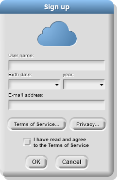
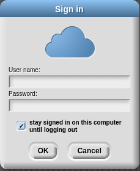

## Using Snap!
Snap! is a blocks-based graphical programming language that allows users to create interactive animations, games, and more, while learning about mathematical and computational ideas. 
Snap! was inspired by Scratch, but also targets both novice and more advanced users by including and expanding Scratch's features.
Snap! is entirely browser made, you can use it from the [official website](http://snap.berkeley.edu/snapsource/snap.html) but you can also use a [copy of the website](https://github.com/jmoenig/Snap--Build-Your-Own-Blocks/archive/v4.0.2.zip) in your personal computer and open the snap.html file in your browser.
**Note: Even if Snap! use JavaScript and HTML5 which are browser independent technologies, opening blocks for Poppy robots in Snap! is far faster in a web browser based on Webkit engine. We strongly recommend you to use [Chromium Browser](http://chromium.woolyss.com/)(which is very similar to Chrome without tracking tools), or Google Chrome.** 

### Introduction to Snap! programming 
#### Saving in Snap!
There is three way of saving a project in Snap!
##### Save the project in your web browser

When you are not logged in Snap! cloud, the default behaviour of Snap! is to save you project in **your browser**.
Technically this use the Local Storage which is a memory space in your web browser where websites are allowed to store offline datas. This is very convenient because you have not to register or to see Snap! project files, but keep in mind that **these projects are only visible in this specific web browser in this specific computer**.
##### Snap! Cloud
« There is no Cloud, it's just someone else's computer ».

Instead of saving your projects on your web browser, you can save them in Snap! servers, called "cloud". Moreover, this allow you to share your project with anyone, with a simple HTML link. 

###### Create an account on Snap! cloud
Click on the cloud button -> signup.

Fill the required fields in the popup for signing up.

You will soon receive a validation email with a random password.
You can now login with your username and password 

If you are in your personal computer, think to check the "stay signed in on this computer ..." checkbox.

After login with your new account, you are free to change your password: click on the cloud button -> Change Password.

###### Share your Snap! project
The big advantage 
##### Export your Snap! project

#### Saving in Snap!
### Presentation of 
### Short description of Poppy blocks

### Short examples
#### Record and by demonstration movement  