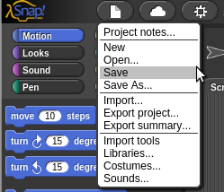
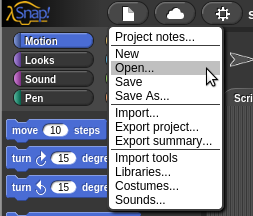
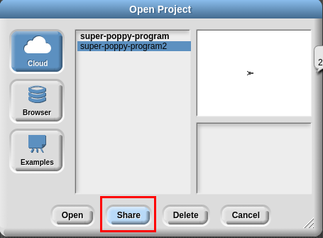
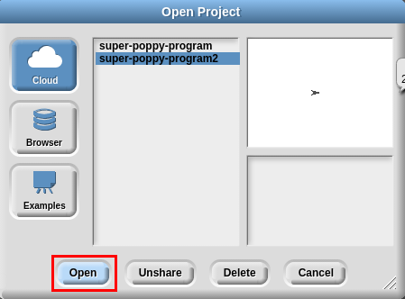
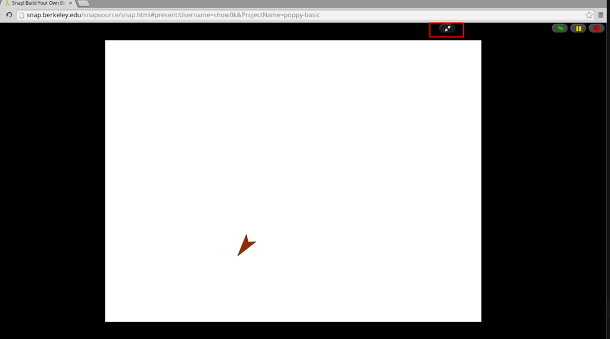
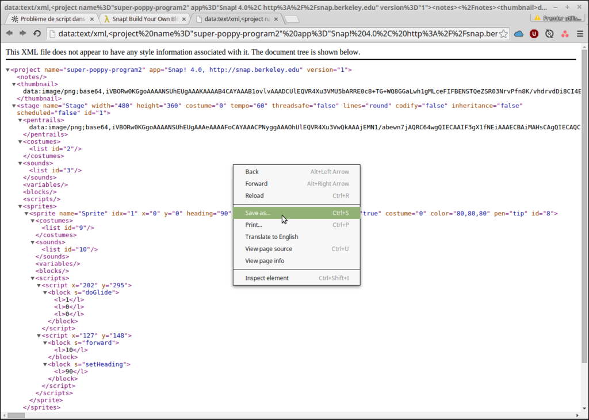
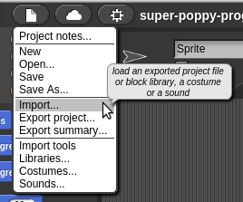
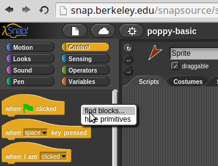
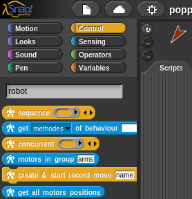
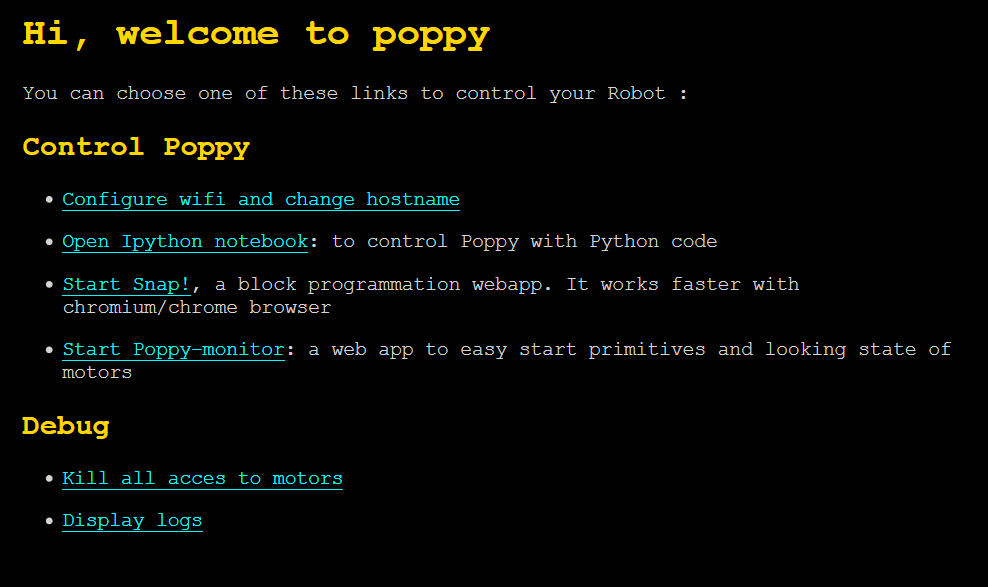

# Programming Poppy robots using Snap!
Snap! is a blocks-based graphical programming language that allows users to create interactive animations, games, and more, while learning about mathematical and computational ideas. 

Snap! was inspired by Scratch, but also targets both novice and more advanced users by including and expanding Scratch's features.

Snap! is entirely browser made, you can use it from the [official website](http://snap.berkeley.edu/snapsource/snap.html) but you can also use a [copy of the website](https://github.com/jmoenig/Snap--Build-Your-Own-Blocks/archive/v4.0.2.zip) in your personal computer and open the snap.html file in your browser.

**Note: Even if Snap! use JavaScript and HTML5 which are browser independent technologies, opening blocks for Poppy robots in Snap! is far faster in a web browser based on Webkit engine. We strongly recommend you to use [Chromium Browser](http://chromium.woolyss.com/)(which is very similar to Chrome without tracking tools), or Google Chrome.** 

## Introduction to Snap! programming 
This chapter will focus on things necessary to understand in Snap! for using Poppy creatures. 
If you want a well designed online lesson on Snap! we strongly encourage you to look at the ["Beauty and Joy of Computing"](http://bjc.edc.org/bjc-r/course/bjc4nyc_2015-2016.html) (BJC) course made by the University of Berkeley for New York high school students.
Some of the snapshots and concepts of BJC have been used for writing this chapter.
### Interface and general idea
### Saving in Snap!
There is three way of saving a project in Snap!
#### Save the project in your web browser

When you are not logged in Snap! cloud, the default behaviour of Snap! is to save you project in **your browser**.
Technically this use the Local Storage which is a memory space in your web browser where websites are allowed to store offline datas. This is very convenient because you have not to register or to see Snap! project files, but keep in mind that **these projects are only visible in this specific web browser in this specific computer**.

#### Snap! Cloud
« There is no Cloud, it's just someone else's computer ».

Instead of saving your projects on your web browser, you can save them in Snap! servers in UC Bercley, called "cloud". Moreover, this allow you to share your project with anyone, with a simple HTML link. 

##### Create an account on Snap! cloud
Click on the cloud button -> "signup...".

Fill the required fields in the popup for signing up.

You will soon receive a validation email with a random password.
You can now login with your username and password 

If you are in your personal computer, think to check the "stay signed in on this computer [...]" checkbox.

After login with your new account, you are free to change your password: click on the cloud button -> "Change Password".

##### Share your Snap! project
The big advantage of using Snap! cloud is the ability to share a copy of your project with anyone.
To share a Snap! project, you first need to be logged in Snap! cloud and having your current project saved ("save" or "save as"). Go to the "open" menu:
 

In the cloud section, select the project you want to share and click on "Share" button.

**Here is the trick step:** to see the share link, you have to click on the "Open" button.

And this will re-open your project with the public sharing URL.

You can copy and paste the URL and share it by the way you want to your friends or to the Poppy community with the forum [forum.poppy-project.org](https://forum.poppy-project.org/).

When you open a share project, the project is automatically opened in full screen on the sprite zone. To quit the full screen you have to click on the double arrow at the top of the snapshot below.

#### Export/Import your Snap! project
If you have a limited access to internet and you want to share project with other people, the best way is to export it:

A new tab in your web browser will be opened with an XML file like the picture below. 

This file describe all your Snap! project in a a simple file. It's not made to be human readable so don't be afraid, you just have to save it on your computer. For that, do a right click, chose "save as" and a proper name and location on you computer for this project.

If you want to import a previously exported project, you simply have to click on the import section of the file icon. 

### Search Poppy blocks
Every Poppy blocks in Snap! begin by a robot icon. So you can search them by the robot keyword. To search a specific block, do a right click on the block area, or use the keyboard shortcut CTRL+F.

### First steps with Snap! and a Poppy creature
#### Test the connection between Snap! and your creature
##### If you are using a tangible robot
First, you must be connected to the same network LAN area than your robot (e.g. on the same router).

You have to go on the web homage of your robot with its URL. You can use its IP address (for example http://192.168.1.42) if you have a way to know it or its hostname like http://poppy.local. To find its IP address you can see it in your router administration web page, or with a network scanner like ["Fing"](http://www.overlooksoft.com/download) (for smartphone and desktop OS). To use directly its hostname http://poppy.local you must have a [Zeroconf](https://fr.wikipedia.org/wiki/Zeroconf) software installed on your computer, install "Bonjour print services for Windows" if you are running a Windows OS.

<!-- TODO screenshot interface-->
The home page of your poppy creature should look like the snapshot below:

Open the Snap!

##### If you are using the V-REP simulator
Open V-REP, open a terminal (called *Command Prompt* on Windows), type and press Enter to execute the command below:

`poppy-services --snap --vrep poppy-torso`

*Substitute 'poppy-torso' with 'poppy-humanoid' or 'poppy-ergojr' to launch respectively a Poppy Humanoid or a Poppy Ergo Jr*.

If you have issues, look at the <!-- TODO --> section to see have more detailed informations.

After having executed this command

#### Network
Be sure to 
You can explore
You can explore

### Build your own blocks !
The functionality to build your own block was the first difference between Scratch and Snap! (now it's also possible to make custom blocks in Scratch) !
<!-- TODO -->

## Description of Poppy blocks
|        |   |   |   |   |
|---|---|---|---|---|
|   |   |   |   |   |
|   |   |   |   |   |
|   |   |   |   |   |

## Quick examples
### Record and play back a move
You can record a movement on one motor and play it back

You can change the speed

You can record it on all motors

or just a subset of your creature

#### Record and by demonstration movement  