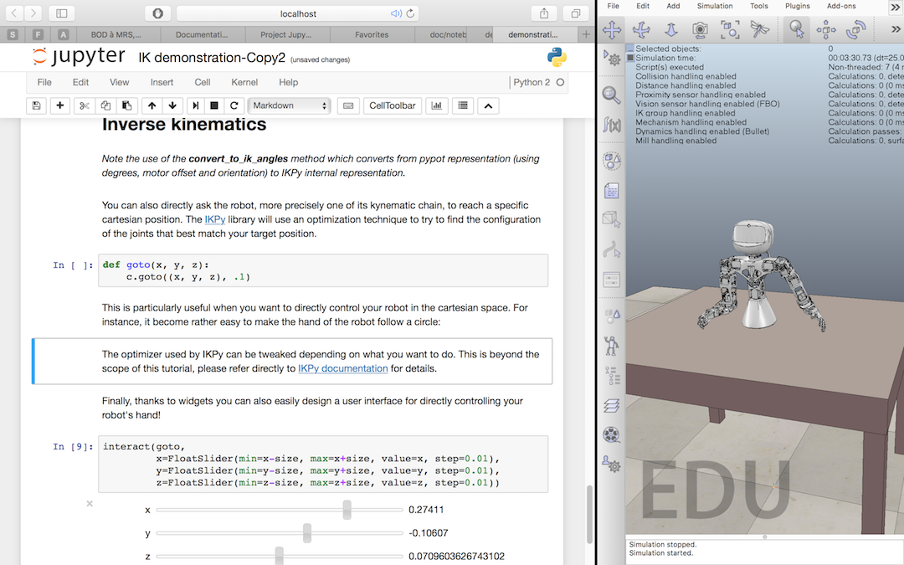

# Jupyter Notebooks Gallery: using Python

Most of the existing examples of using Poppy robots in Python are given as [Jupyter Notebooks](http://jupyter.org). We strongly encourage the use of this web application as it allows "the creation and sharing of documents that contain live code, visualization and explanatory text". Furthermore, they also permit the design of interface for live controlling a robot thanks to widgets.

This chapter presents a gallery of notebooks and tries to organize them into different categories:

* Getting started
* Simulator
* HTTP API and remote connection
* Scientific experiments
* Education
* Going further (advanced topics)

For each notebook, we provide a short description of what it does, with which robot/simulator it can be used and of course a link. Most of the notebooks are written in english but you will also find some in french (and hopefully soon in other languages).

**If you see a notebook missing or want to submit your own, please [let us know](https://github.com/poppy-project/poppy-docs/labels/notebooks)!**

## Getting started

* **Controlling a Poppy Humanoid in V-REP: [Notebook](https://github.com/poppy-project/poppy-humanoid/blob/master/software/samples/notebooks/Controlling%20a%20Poppy%20humanoid%20in%20V-REP%20using%20pypot.ipynb)** - Describe how to setup a Poppy Humanoid in V-REP and how to control it (motor control and sensor reading) from pypot in Python.

* **Record, Save, and Play Moves: [Notebook](https://github.com/poppy-project/community-notebooks/blob/master/demo/poppy-ergo_Record%2C%20Save%2C%20and%20Play%20Moves.ipynb)** - Simple introduction on how to record by demonstration moves on any Poppy Creature. It also shows how they can be re-played and saved/load to/from the disk.

#### Notebooks en français

* **10 choses à savoir avec Poppy Humanoid/ErgoJr et V-REP: [pour l'ErgoJr](https://github.com/poppy-project/community-notebooks/blob/master/tutorials-education/poppy-humanoid_poppy-torso__vrep_installation%20et%20prise%20en%20main/poppy%20simulé/Ergo_simulation%20prise%20en%20main.ipynb), [pour l'Humanoid](https://github.com/poppy-project/community-notebooks/blob/master/tutorials-education/poppy-humanoid_poppy-torso__vrep_installation%20et%20prise%20en%20main/poppy%20simulé/premier%20pas%20avec%20poppy%20humanoid%20en%20python%20-%2010%20choses%20à%20savoir.ipynb)** - 10 informations de base pour bien commencer avec Poppy Humanoid ou Poppy ErgoJr simulés dans V-REP et comment les contrôler en Python.

## Simulator
### V-REP

* **Controlling a Poppy Humanoid in V-REP: [Notebook](https://github.com/poppy-project/community-notebooks/blob/master/demo/poppy-humanoid_Controlling%20in%20V-REP%20using%20pypot.ipynb)** - Describe how to setup a Poppy Humanoid in V-REP and how to control it (motor control and sensor reading) from pypot in Python.

* **Interacting with objects in V-REP: [Notebook](https://github.com/poppy-project/poppy-torso/blob/ff6254355ce18a26f58654f5abc82485a7a22d13/software/doc/tutorial/Poppy%20Torso%20interacting%20with%20objects%20in%20V-REP%20using%20Pypot.ipynb)** - Show how you can programtically add objects to the V-REP simulation and interact with them. This example uses a Poppy Torso but can be easily adapted to other creatures.

* **V-REP simulation benchmark: [Notebook]()** - Check how fast the V-REP simulation is running on your computer. Can be used with the **Humanoid, Torso, and ErgoJr**.

* **Learning the robot IK: [Notebook]()** - Demonstrate how explauto can be used to learn the inverse kinematics of a Poppy robots. The experiments are run in V-REP simulation but it also gives hints on how it can be transposed in the real world.

#### Notebooks en français
* **10 choses à savoir avec Poppy Humanoid/ErgoJr et V-REP [Notebook pour l'ErgoJr](https://github.com/poppy-project/community-notebooks/blob/master/tutorials-education/poppy-humanoid_poppy-torso__vrep_installation%20et%20prise%20en%20main/poppy%20simulé/Ergo_simulation%20prise%20en%20main.ipynb)[Notebook pour l'Humanoid](https://github.com/poppy-project/community-notebooks/blob/master/tutorials-education/poppy-humanoid_poppy-torso__vrep_installation%20et%20prise%20en%20main/poppy%20simulé/premier%20pas%20avec%20poppy%20en%20python%20-%2010%20choses%20à%20savoir.ipynb)** - 10 informations de base pour bien commencer avec Poppy Humanoid ou Poppy ErgoJr simulés dans V-REP et comment les contrôler en Python.

## HTTP REST API and remote connection

* **Controlling a robot using HTTP requests: [Notebook](https://github.com/poppy-project/community-notebooks/blob/master/demo/poppy-humanoid_Accessing%20pypot%20REST%20API%20through%20HTTP%20requests.ipynb)** - Show how you can send HTTP requests to a robot, using the REST API, to control it. The notebook is based on a V-REP simulated Poppy Humanoid but can be adapted to other creatures.

## Scientific experiments
### Discover Explauto

* **Learning the robot IK: [Notebook]()** - Demonstrate how explauto can be used to learn the inverse kinematics of a Poppy robots. The experiments are run in V-REP simulation but it also gives hints on how it can be transposed in the real world.

## Demo interface

* **Primitives launcher: [Notebook](https://github.com/poppy-project/poppy-humanoid/blob/dd469c262ede0877153afd6e086f65fc85e8b729/software/samples/notebooks/Demo%20Interface.ipynb)** - Provides all codes needed to directly launched primitives (stand, sit, idle motions, limit torque...)

* **Simple demo - livecoding: [Notebook](https://github.com/poppy-project/poppy-humanoid/blob/dd469c262ede0877153afd6e086f65fc85e8b729/software/samples/notebooks/TTFX.ipynb)** - Show some basic examples of what you can do with a Poppy Humanoid: start primitives, control motors, get sensor readings. It was designed for a 15 minutes live coding session (in French).

## Education

#### Notebooks en français

#### Initiation à l'informatique en Lycée
* **Découverte: [TP1](https://github.com/poppy-project/community-notebooks/blob/master/tutorials-education/poppy-torso__vrep_Prototype%20d'ininitiation%20à%20l'informatique%20pour%20les%20lycéens/decouverte/Decouverte%20TP1.ipynb), [TP2](https://github.com/poppy-project/community-notebooks/blob/master/tutorials-education/poppy-torso__vrep_Prototype%20d'ininitiation%20à%20l'informatique%20pour%20les%20lycéens/decouverte/Decouverte%20TP2.ipynb), [TP3](https://github.com/poppy-project/community-notebooks/blob/master/tutorials-education/poppy-torso__vrep_Prototype%20d'ininitiation%20à%20l'informatique%20pour%20les%20lycéens/decouverte/Decouverte%20TP3.ipynb)** - Comprendre comment faire bouger simplement le robot. Utilisation des boucles. Ces TPs utilisent un Poppy Torso simulé dans V-REP.

* **Dialogue: [TP1](https://github.com/poppy-project/community-notebooks/blob/master/tutorials-education/poppy-torso__vrep_Prototype%20d'ininitiation%20à%20l'informatique%20pour%20les%20lycéens/dialogue/Dialogue%20TP1.ipynb), [TP2](https://github.com/poppy-project/community-notebooks/blob/master/tutorials-education/poppy-torso__vrep_Prototype%20d'ininitiation%20à%20l'informatique%20pour%20les%20lycéens/dialogue/Dialogue%20TP2.ipynb)** - Établir un dialogue entre Python et le robot. Ces TPs utilisent un Poppy Torso simulé dans V-REP.

## Going further
### Low-level communication
* **Configure a new motor directly in Python: [Notebook]()** -

### Debug and setup

* **Configure a new motor directly in Python: [Notebook]()** -

### Benchmark

* **Trajectory following: [Notebook  ](https://github.com/poppy-project/community-notebooks/blob/master/debug/mini-4dof-arm-mini_benchmark_XL320.ipynb)** - Measure how precisely a **Poppy mini-4dof** follows a given trajectory. It measures the position, speed and load of multiple motors on a fast and a slow trajectory.

* **V-REP simulation benchmark: [Notebook]()** - Check how fast the V-REP simulation is running on your computer. Can be used with the **Humanoid, Torso, and ErgoJr**.

### Extending Poppy softwares

* **Define your own Poppy creature: [Notebook]()** -
