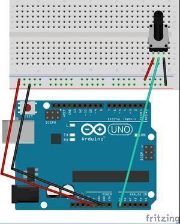
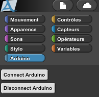
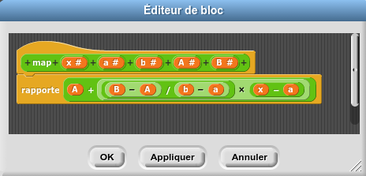

## Contrôler Poppy avec un Arduino via Snap4Arduino

*Written by [Gilles Lassus](https://forum.poppy-project.org/users/gilles_lassus).*


**Objectif** : contrôler un moteur de Poppy par un potentiomètre sur la platine Arduino.

### Préparation de Snap4Arduino
* Téléchargez et installez [Snap4Arduino](http://s4a.cat/snap/).
* Téléchargez les blocs [pypot-snap-blocks.xml](https://raw.githubusercontent.com/poppy-project/pypot/master/pypot/server/snap_projects/pypot-snap-blocks.xml). Ils devront être importés dans Snap4Arduino à chaque démarrage.

### Préparation de l'Arduino

* Connectez votre platine, ouvrez Arduino et téléversez le firmware StandardFirmata. (disponible via Fichier - Exemples - Firmata).
* Branchez un potentiomètre sur la sortie analogique A0, comme illustré ci-dessous  :




### Lancement de la simulation (dans le cas d'un Poppy simulé dans Vrep)

* Lancez Vrep .
* Exécutez les commandes python suivantes :

```python
from poppy.creatures import PoppyHumanoid

poppy = PoppyHumanoid(simulator='vrep', use_snap=True)
```

puis
```python
poppy.snap.run()
```

### Ouverture de Snap4Arduino

* Lancez Snap4Arduino et importez les blocs *pypot-snap-blocks.xml*.
(une fenêtre avertissant que le projet importé a été créé par Snap! apparaît ; elle est sans conséquence.)
* Dans les blocs Arduino, cliquez sur *Connect Arduino *pour établir la connexion entre Snap4Arduino et votre platine.


Un message de confirmation apparaît, signe que la connexion est effective.

### Commander un moteur via le potentiomètre

La valeur analogique lue dans A0 est un entier entre 0 et 1024. Pour la "mapper" entre (environ) -40 et 40, on la divise par 12 avant de lui soustraire 40.
On peut donc alors construire l'instruction suivante, qui fera bouger le moteur *head_z* de Poppy entre -40° et +40° :


### Remarques diverses

* Il peut être utile de créer un bloc *map* (une version [ici](https://raw.githubusercontent.com/poppy-project/poppy-docs/master/resources/block_map.xml)) équivalent à la fonction éponyme d'Arduino, permettant de mettre à l'échelle automatiquement une valeur dans une plage donnée :



Le script de commande du moteur *head_z* de Poppy entre -40° et 40° deviendrait alors :


* Cette méthode de contrôle a pour principal défaut de "bloquer" la carte Arduino avec le StandardFirmata : il serait plus agréable de pouvoir simplement lire les données du port série envoyées par l'Arduino, et ainsi pouvoir téléverser le programme de son choix dans l'Arduino. Ceci est discuté [ici](https://forum.poppy-project.org/t/snap-et-arduino/1892/2 ).
Toutefois, la page du projet  [Snap4Arduino](http://s4a.cat/snap/) liste les composants annexes (LCD display, UltraSound Sensor) pouvant être directement contrôlés, et explique en [détail](http://blog.s4a.cat/2015/03/13/Extending-Firmata-for-Snap4Arduino.html) comment modifier le StandardFirmata pour intégrer un nouveau composant.
