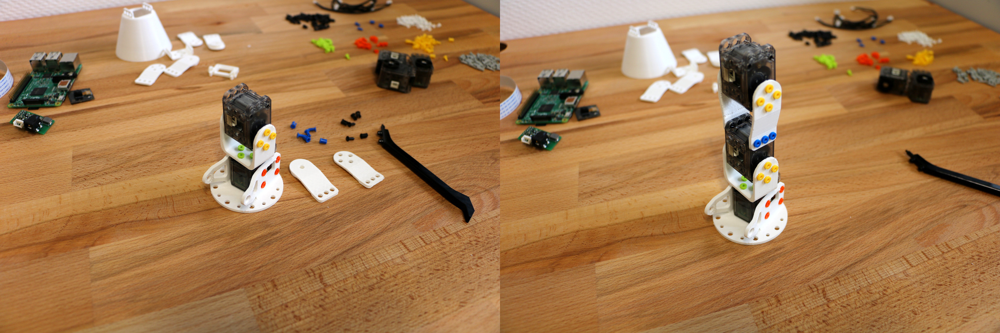
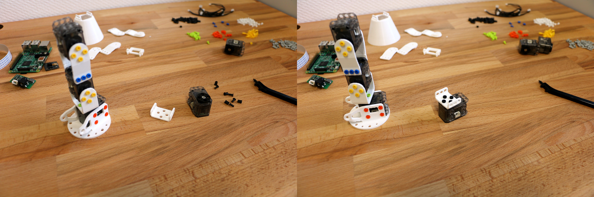
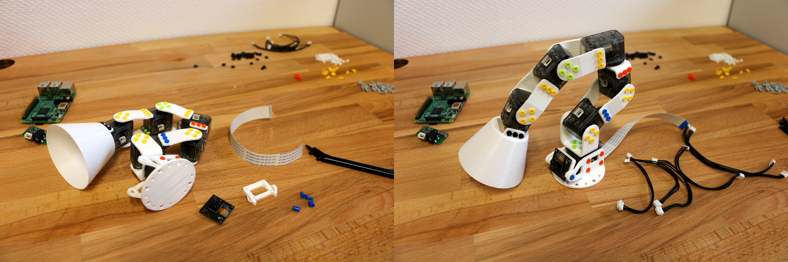
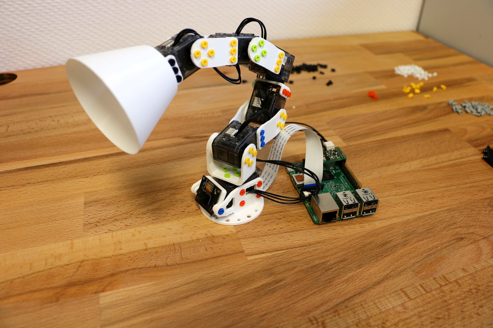
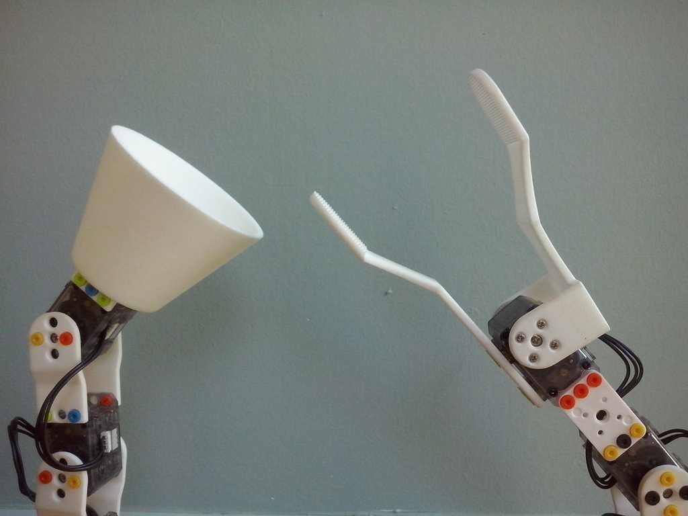

# Mechanical Assembly

## General advices and warnings

<!-- TODO:
* picture rivet black vs grey
* ergo + wires
-->

* You can assemble all the rivets you need before the construction. You have to put the edges of the first part in the second part holes. You will thus be able to remove them easily if needed.


* There are two kinds of rivets. The grey ones and the others. Grey rivets are longer to be able to be inserted in the motor axis, at the opposite side of the horn.

<!-- HTML link to adapt image size -->


* Use the OLLO Tool for putting and removing rivets easily.

<!-- HTML link to adapt image size -->


* Do not forget to put wires between motors while building the robot! Each motor, except the last, must have two wires; one connected to the previous motor and the other to the next (no favourite side).


* **Always align the horn with the motor before assembling them!** Otherwise your Poppy Ergo Jr will look all weird.

<!-- HTML link to adapt image size -->


* Every motor horns (black revolving circle) are **facing the left side of the robot**. It is a convention but it will define the orientation of your motors.


## Step-By-Step guide

### Motor configuration (for all steps)

You can configure your motors before, during or after the the mechanical assembly but it is highly advised to configure each motor one by one in the construction order :
* configure motor m1
* assemble the base and motor m1
* configure motor m2
* ...


> **Caution** To configure motors, you have to connect them separately one by one to the Raspberry Pi. If you try to configure a new motor wired to a previously configured motor, this will not work.


Please consult the [motor configuration section](motor-configuration.md) for more informations.

### Step 1
First, [configure one XL-320](motor-configuration.md) motor as "m1".

Mount the motor on the 3D printed base.


To do so, prepare 8 small rivets. put the first part in the second part without putting them in the motor. Then, place the motor in the base, with the horn facing up and near the more open side.
Use the Ollo to grab a rivet between the first and the second part, then put the rivet in one the assembly holes. Once the rivet is in place, lock it by pushing the part 1 of the rivet in part 2.


### Step 2
Configure the second motor, its name is "m2", with the following command in a poppy terminal:
```bash
poppy-configure ergo-jr m2
```

Mount the *long_U* part. Be careful with the orientation of the U, the horn must be oriented in the left.
Mount the motor "m2" on top of the construction.


### Step 3
Configure a third motor: "m3".

Mount *horn2horn* and *horn2side* parts on motor "m2", and mount "m3" on top of the construction.



### Step 4

Configure the fourth motor: "m4".

Mount the *short_U* on it.


Mount motor "m4" and the assembled *short_U* on top of the previous assembly. The nose of the motor should be on the other side of the base.


### Step 5

Configure the fifth motor: "m5".

Mount *horn2horn* and *horn2side* parts on motor "m4", and mount "m5" on top of the construction.


### Step 6 - the tool of your choice
Configure the sixth motor: "m6".

To finish your Ergo Jr, you need to add a tool at its end. So first choose the tool you want depending on what you want to do.

> **Note** Tools they can be easily and quickly changed, so you can adapt it to the different activities.

#### Lampshade or pen holder
Mount *horn2horn* and *horn2side* parts on motor "m5", and mount "m6" on top of the construction.


You can mount the pen holder or the lampshade on the motor "m6".


#### Gripper
Mount the [*gripper-fixation*](https://github.com/poppy-project/poppy-ergo-jr/blob/master/hardware/STL/tools/gripper-fixation.stl) between motors "m5" and "m6".

Mount *gripper-fixed_part* and *gripper-rotative_part* on motor "m6".
<!-- TODO closed picture of gripper-->


### Step 7 - electronics
Mount the support_camera part on the base. Fix the Raspberry Pi camera on it and move the camera flex cable between motor "m1" and the base.


To fix the flex cable of the camera on the Raspberry Pi:
* open the camera connector by pulling on the tab
* make sure that connectors on the flex cable are facing away of the ethernet port
* push the flex on the port, and push the plastic tab down

<!-- TODO: add a closed picture of camera fix-->
**Motors wires:**

If it is not already done, you can plug every motors wires. Every motor has two connectors but there is no input or output: you just have to create a chain of motors. The first motor is linked to the pixl and the second motor; the last motor is linked only to the previous one, and every other motors are linked to the one above and ahead.

<!-- TODO picture of OLLO + base rivets -->
> **Info** Connectors of the motor "m1" (in the base) are a bit hard to link, you can use the OLLO tool to help yourself.



### Step 8 - fix you Ergo Jr to wood disk support
Mount your Ergo Jr to the wood *disk-support*.

Mount the Raspberry Pi to the disk support, and use 4 x M2.5x6mm screw to fix it.
<!-- TODO: picture of disk fixation -->

### Done



Grab your [favourite drink](https://www.flickr.com/photos/poppy-project/16488256337/) and relax.
