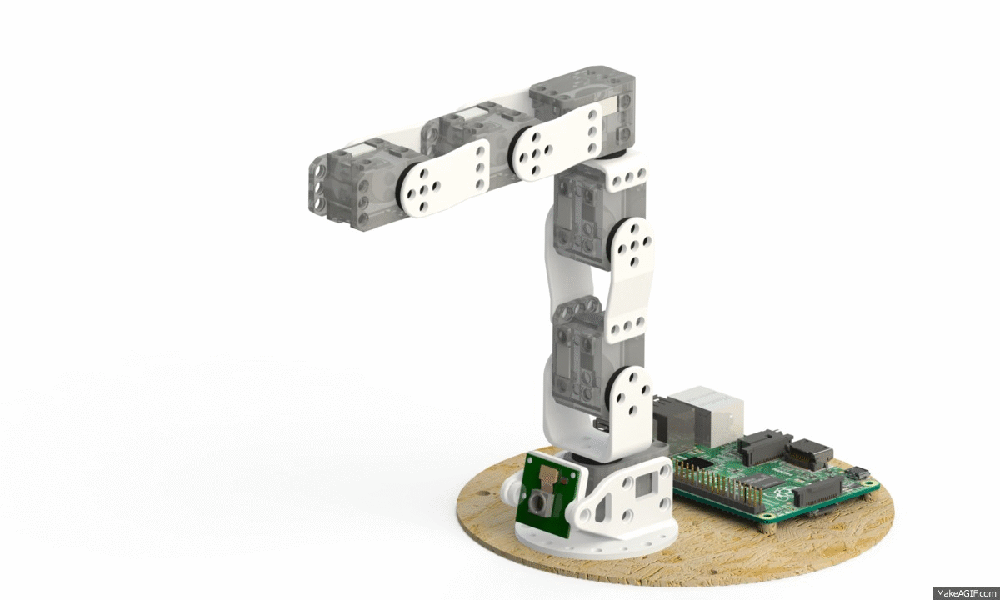
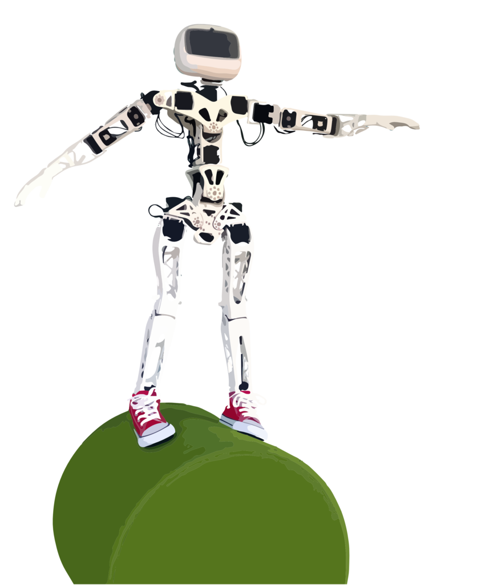
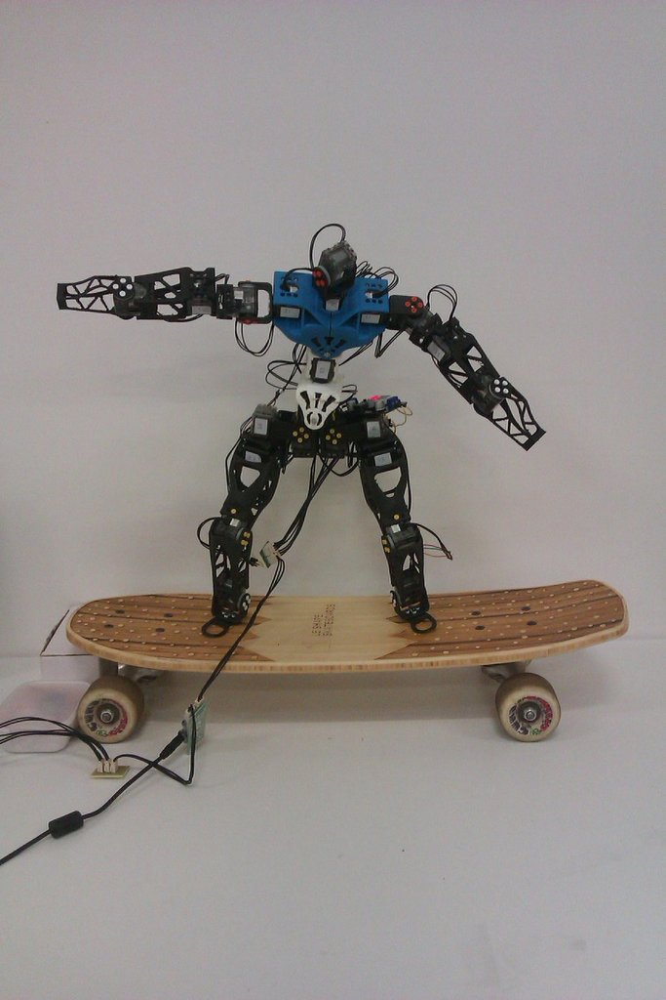

# Getting Started

[Poppy Project](https://www.poppy-project.org/) is an open-source platform for the creation, use and sharing of interactive 3D printed robots. It gathers an interdisciplinary community of beginners and experts, scientists, educators, developers and artists. They all share a vision: robots are powerful tools to learn and be creative and collaborate to improve the project. They develop new robotic behaviors, create pedagogical contents, design artistic performances, improve the software or even create new robots.

The [Poppy community](https://forum.poppy-project.org/) develops robotic creations that are easy to build, customize, and deploy. We promote open-source by sharing hardware, software. A web platform is associated enabling the community to share experiences and to contribute to its improvement.

To ease these exchanges two supports are available:

- [The poppy-project forum](https://forum.poppy-project.org/) for help, discussions and sharing ideas.
- [GitHub](https://github.com/poppy-project) to submit your contributions.

All sources of the Poppy Project (software and hardware) are available on [GitHub](https://github.com/poppy-project).

The Poppy project has been originally designed at [Inria Flowers](http://www.inria.fr/equipes/flowers/).

## The Poppy creatures

Poppy creatures are open-source robots, available for download and modification ([Creative Commons Attribution-ShareAlike](http://creativecommons.org/licenses/by-sa/4.0/) for the hardware and [GPLv3](http://www.gnu.org/licenses/gpl-3.0.en.html) for the software). They were designed with the same principles in mind.

All Poppy creatures:

- are made from pieces of printable 3D and Dynamixel motors,
- use an embedded board for control (a Raspberry Pi 2 or Odroid for older versions),
- are based on a Python library, [pypot](../software-libraries/pypot.md), allowing to control Dynamixel servomotors in an easy way,
- have a simulated version available (based on [V-REP](http://www.coppeliarobotics.com)),
- can be controlled using a visual programming language ([Snap!](http://snap.berkeley.edu) a variation of Scratch) and a textual language [Python](https://www.python.org). They are also programmable through a REST API, which enables the control with other programming language,
- come with associated documentation, tutorials, examples, pedagogical activities.

They can be used as it is, or hacked to explore new shapes, add sensors, etc...

To get your own Poppy robot, you can either:
* Get all the parts yourself by following the bill of materials (see below).
* Buy a full Poppy robotic kit from our [official retailer](http://www.generationrobots.com/en/279-poppy-opensource-robotics-platform).

### Poppy Ergo Jr

The Poppy Ergo Jr robot is a small and low cost 6-degrees-of-freedom robot arm. It is made of 6 cheap motors (XL-320 Dynamixel servos) with simple 3D-printed parts.

The 3D parts were made so they can be easily printed on a basic 3D printer. The motors are only 20€ each. Its electronic card access is simple. It makes it easy to connect extra sensors and is well suited for pedagogical purposes.

You can choose among three tools at the end of its arm:

* A lamp.
* A gripper.
* A pen holder.

The rivets used make it easy and quick to change the tools. You can adapt it depending on the type of activities you are doing.

The Ergo Poppy Jr is ideal to start manipulating robots and learn robotic without difficulties. It is simple to assemble, easy to control and low price.

You can get all the parts yourself following the [bill of materials](https://github.com/poppy-project/poppy-ergo-jr/blob/master/doc/bom.md) (BOM) and print the [3D parts](https://github.com/poppy-project/poppy-ergo-jr/releases/) available in the STL format.

For more information, check the [assembly guide of the Ergo Jr](../assembly-guides/ergo-jr/README.md).

### Poppy Humanoid

It is a 25-degrees of freedom humanoid robot with a fully actuated vertebral column. It is used for education, research (walk, human-robot interaction) or art (dance, performances). From a single arm to the complete humanoid, this platform is actively used in labs, engineering schools, FabLabs, and artistic projects.

You can get all the parts yourself following the [bill of materials](https://github.com/poppy-project/poppy-humanoid/blob/master/hardware/doc/BOM.md) (BOM) and print the [3D parts](https://github.com/poppy-project/poppy-humanoid/releases/tag/hardware_1.0.1/) available as STL, STEP and Solidworks 2014 format.

### Poppy Torso

It is the upper part of Poppy Humanoid (13 degrees of freedom). Poppy Torso is thus more affordable than the complete Poppy Humanoid. It makes it a more suitable solution for educational, associative and makers contexts. Poppy Torso can be a good medium to learn science, technology, engineering and mathematics (STEM).

You can get all the parts yourself following the [bill of material](https://github.com/poppy-project/poppy-torso/blob/master/hardware/doc/BOM.md). The [3D models](https://github.com/poppy-project/poppy-humanoid/releases/tag/hardware_1.0.1/) for the parts are the same as Poppy Humanoid, without the legs and with an extra [suction cup support](https://github.com/poppy-project/robot-support-toolbox/).

### Other interesting Poppy Creatures

A key aspect of the Poppy Project is to stimulate creativity and experimentation around robotics. We try to provide all the tools needed to design new robots based on the same technological bricks. Some new creatures are in development within the community. Some of them are presented in the section below.

#### Poppy right arm (work in progress)

Poppy right arm is a Poppy creature based on a right arm of Poppy Humanoid, with 3 additional XL-320 motors at the end to improve the reach and agility of the arm. It used the same gripper tool used in the Ergo Jr, designed to grab simple objects.

The project was realized during an internship at Inria Flowers by [Joel Ortiz Sosa](https://github.com/joelortizsosa). Find more info and the sources in the [repository](https://github.com/poppy-project/poppy-6dof-right-arm).

#### Small and low-cost humanoids

##### Heol

Heol - meaning "sun" in Breton - is a 34cm tall humanoid robot made by the association [Heol robotics](http://heol.io/). 23 motors compose it, all other parts are 3D printed. It also uses the pypot library for its movements.

Heol's purpose is to put a smile on ill children's faces. It can be an educational tool by becoming a learning support materials for programming and mechanical design.

Its participation in the RoboCup (World Cup football for robot) is also envisaged.

##### [Poppyrate](http://www.poppyrate.com/)

It a robot based on Poppy Humnaoid. It aims at developing a more affordable version thanks to its smaller size and the use of cheaper motors. The size reduction also makes it easier to print the parts on a standard 3D-printer. Goals also involved making it as mobile and customisable as possible while maintaining compability with Poppy software.

Poppyrate will be sold as a kit (with and without the 3D parts) It has been designed by the socity ZeCloud.

For more information, check their [Website](http://www.poppyrate.com/) - [Twitter](https://twitter.com/poppyratproject) - [Facebook](https://www.facebook.com/Poppyrate/)!
