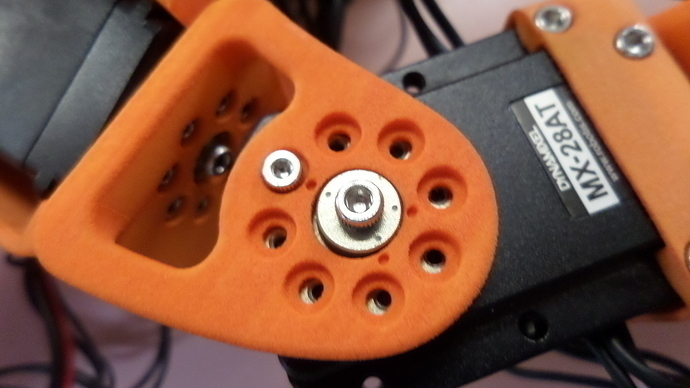

## Build the robot

Depending on the Poppy robots you are planning to use, the assembly time, required skills, tools and difficulty may vary a lot. Building an Ergo Jr should take about one hour and no specific tool is needed while assembling an entire Poppy Humanoid may take a few days and quite a lot of screws!

This section intends to give you hints and a glimpse of some critical points so you aware of them before digging into the construction. We will also point to each dedicated chapter where you will find the resources and detailed step by step assembly procedure for each robot.

### Assembling an Ergo Jr

> **Note** You can find a full assembly documentation in the chapter [step by step assembly of an Ergo Jr](../assembly-guides/ergo-jr/README.md).

<!-- TODO: refaire une belle photo avec la vraie BOM -->

The Ergo Jr robot was designed to be a simple little robot, cheap and easy to use. The 3D parts were made so they can be easily printed on a basic 3D printer and the motors (6 XL-320 Dynamixel servos) are only 20$ each. 

The Ergo Jr is very easy to build and its end effector can be easily changed - you can choose among several tools: a lamp, a gripper, a pen holder...

Thanks to OLLO rivets the robot is very simple to assemble. These rivets can be removed and added very quickly with the OLLO tool. It should not take more than one hour to entirely built it, which allows great design freedom.

<!-- TODO: image des rivets et du tool en action -->

Except from **checking the motor orientation**, there is not really any pitfall. If you are familiar with Lego bricks, you should be able to assemble an Ergo Jr without much problem! Rivets were made to be as easy to assemble than to disassemble, so in case of problem you can just start over!

Also make sure, to [**configure your motors**](../assembly-guides/ergo-jr/motor-configuration.md) before assembling the robot as it is harder to do after!

### Assembling a Torso or a Humanoid

> **Note** You can find a full assembly documentation in the chapter [step by step assembly of a Poppy Humanoid](../assembly-guides/poppy-humanoid/README.md).

Building a Poppy Torso or a Humanoid is more complex than a Ergo Jr but it is not really more complicated than building a Meccano or some Swedish furniture. It mainly consists on those few steps:

<!-- TODO: add links of the advanced doc -->
* assemble the horn on each motors: **you will have to be really cautious about the motor zero position!**
* configure the motors so they match the *poppy configuration*
* use a lot of screws to connect all 3D printed parts to the motors
* do a bit of electronic for the embedded board inside the head: this can be a bit tricky if you are not familiar with electronics.

**Patience and precision** are your allies, but in case of errors do not panic: Poppy is a robot intended to be assembled and disassembled. If you pay attention to the few **warnings** bellows, and with a few trials and errors you will have a working Poppy Torso or Poppy Humanoid:

*Warning 1: The Poppy humanoid and torso robots are built using mainly MX-28 and MX-64 Dynamixel servomotors. They are pretty powerful and may be harmful to your fingers or materials. So be very careful and put the robot in a free space while testing it!*

*Warning 2: Put the dot on the horn at the same point than the dot on the servo axis.*

*Warning 3: Adjusts the three dots of the motors with the three dots of the structural part.*

*Warning 4: Use thread locker to prevent vibrations from untying the screws. However, dipping the extremity of the screw on the thread locker is enough (a drop for each screw hole is too much). Otherwise disassembling your robot can be very hard!*

<!-- TODO: Add directly the youtube playlist of poppy torso and humanoid-->

**Step by step guide for the asssembly :**

- [Guide for the Humanoid](https://github.com/poppy-project/poppy-humanoid/blob/master/hardware/doc/Poppy_Humanoid_assembly_instructions.md)
- [Guide for the Torso](https://github.com/poppy-project/poppy-torso/blob/master/hardware/doc/Poppy_Torso_assembly_instructions.md)
