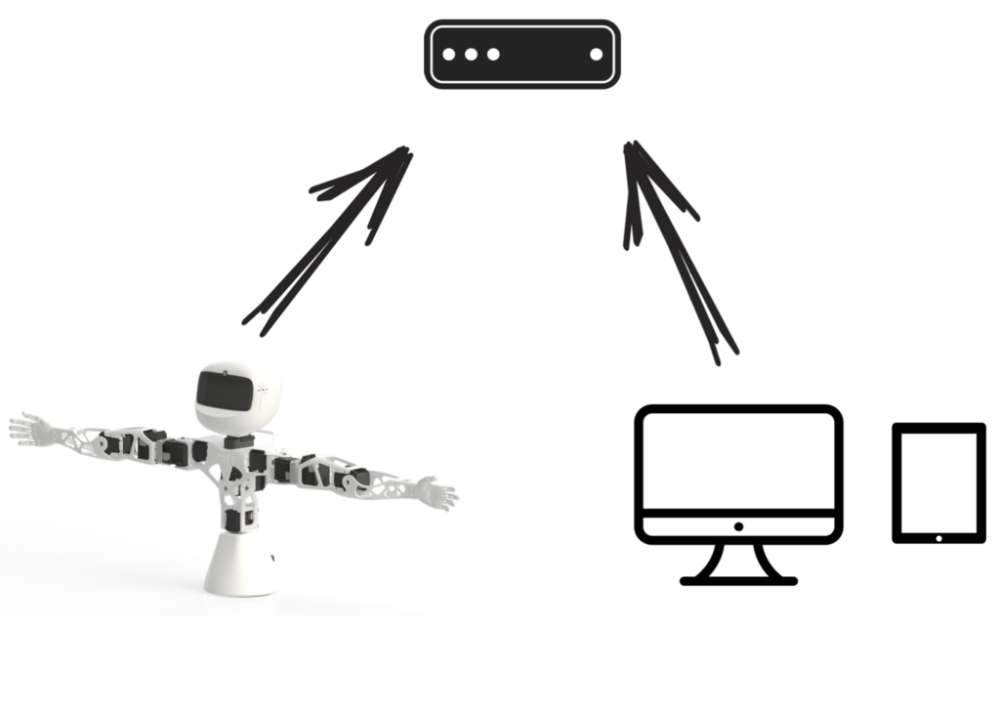

## Start and connect the robot

In this section, we will describe how to start your robot and a give an overview of the possibilities to connect to it. We will focus here on real robots but we will also point to the advanced sections to follow if you are using a simulated robot.

### Setup the software

Poppy creatures come with an embedded board which job is to control motors and access the sensors. This computer can be access through a web interface which makes it easy to control the robot from your own computer or a tablet without having to locally install anything specific.

There are two ways to setup the board for your Poppy:
* **[the easy way](#easy-way-use-the-poppy-sd-card)**: use a pre-made ISO image of the Poppy operating system and write it to an the SD-card
* **[the hard way for advanced users](diy-install-everything-from-scratch)**: install everything from scratch

*Note: If you are using a simulated robot, you  must install the software locally. Thus, you can not use a pre-made SD-card. You will have to follow steps from the advanced way adapted to your configuration (OS, architecture...). The Chapter [TODO USE SIMU](#TODO) will guide you through all the detailed steps.*

#### Easy way: use the Poppy SD-card

The easiest and quickest way - by far - is to use an already made system image for a SD-card. ISO images come with everything pre-installed for your Poppy robot. It is also a good way to ensure that you are using exactly the same software as we are. Thus, you will avoid most problems.

The images can be found in the [github of the project](#TODO):

* [for the ErgoJr](#TODO)
* [for the Torso](#TODO)
* [for the Humanoid](#TODO)

They can be written to a SD-card (at least 8Go) by using classical utility tools. Details can be found on the procedure of <!-- TODO :lien interne -->
Once the SD-card is ready, just insert it into the board and when you plug your robot it should automatically start and you should then be able to connect to the web interface.

#### Advanced way: DIY, install everything from scratch

The other way is basically to install everything needed from scratch. This basically means follow the same procedure as we are, to generate the image for SD-card. This can be useful if:

* You are **working with a simulated robot** and thus have to manually install all the required softwares on your computer, this procedure could be a good place to see how this can be done on a Raspberry-Pi and adapted to another computer,
* you want to customize the environment,
* or simply if you like to understand how it works.

**Warning:** *We try to keep this installation procedure as generic as possible. Yet, some details may vary depending on your operating system or your computer. Moreover, the installation from scratch required some good knowledges of how to install and setup a python environment.*

The entire procedure is detailed in the [Chapter TODO](#TODO). Depending on what you want to do all steps are not necessary required. In particular, you may just want to install the python libraries for Poppy, or entirely setup a Linux environment to match the Poppy ones. The entire installation process used to make the SD-card image can be sum up with those steps:
* Customize a [Raspbian](https://www.raspbian.org) install for Poppy (setup a user/hostname...).
* Setup the Poppy utility tools (for install/update)
* Install the [Python Anaconda distribution](https://www.continuum.io/why-anaconda).
* Install the [python libraries](TODO pypot/poppy-creature/poppy-\*)) for Poppy.
* Setup the sensors for your creature.
* Install the web server for the control and monitoring interface.

### Setup the network

Once your Poppy is built and its software is ready, the next step is to connect it to a network so you can start access it from your computer or smartphone/tablet and then control and program it.

Indeed, except if you plug a keyboard and a screen to the embedded board you will not be able to directly use it. Thus, you have to connect to it to your network so you can remotely access it. This section will describe the main steps to follow in order to do that.

Poppy robots can use either ethernet (using cable) or wifi network. Yet, you first need to use an ethernet network so you can first configure the robot so it can then automatically use your specified wifi.

Poppy robots can use either Ethernet or wifi network. But first, plug the robot and your computer on the same Ethernet network.

Then, you need to choose among the two different possibilities:

*  Use the [Zeroconf protocol](https://fr.wikipedia.org/wiki/Zeroconf) to connect to the robot using its hostname: *"poppy.local"*. This should works directly under Mac OS and GNU/Linux but required to install [*Bonjour Print Services*](https://support.apple.com/kb/DL999) on Windows. This is the simplest way and should be preferred except if you do not have the administrator right on your Windows computer for instance. Note that *Bonjour Print Services for Windows* may be already installed if you have iTunes or QuickTime on your computer.
* Know the IP address of the robot assigned by the router of your network.

**Note: If you are not familiar with network configuration or have no idea what the previous paragraph clumsily tried to say, you should see with the IT network engineer, how you can do that.**

### Use the web interface

One you managed to have either Zeroconf working or the IP address of you robot, you can directly access the control and monitoring interface. This web interface can be used to:

* setup your wifi and change the name of the robot - the one you will use to connect,
* to launch demo primitives,
* and monitor the state of your robot (if motors are too hot for instance).

To access this interface, you simply have to go to the URL using your favourite web browser:

* http://poppy.local (if you changed the name of your robot, simply replace *poppy* by its new name)
* or using directly its IP address, something similar as http://192.168.0.42

You should see something like:

And then if you click on the **Start Poppy-monitor** link:

