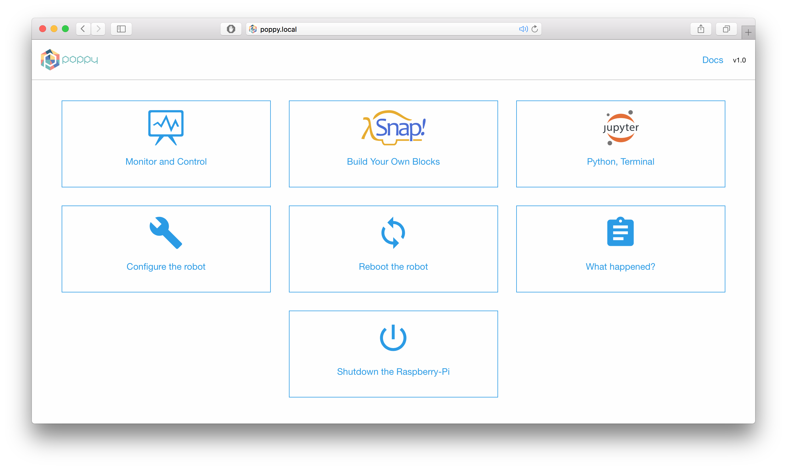
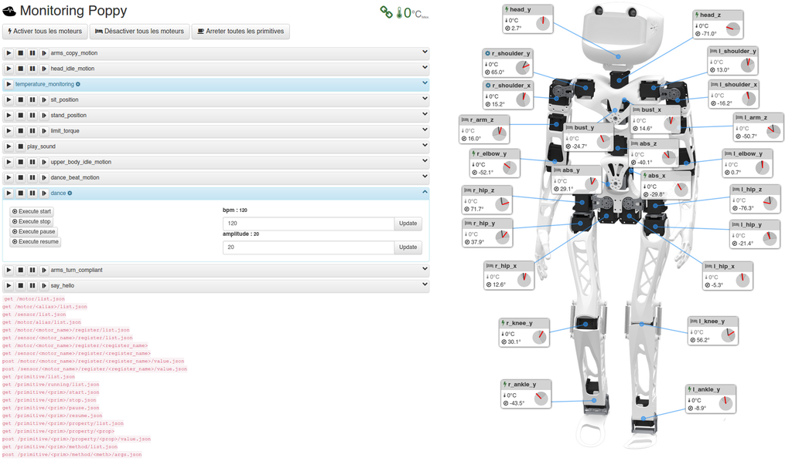

# Start and connect the robot

In this section, we will describe how to start your robot and a give an overview of the possibilities to connect to it.

## Setup the software

Poppy creatures come with an embedded board which job is to control motors and access the sensors. For simplicity purpose, this computer can be remotely access through a web interface. It makes it easy to control the robot from your own computer or a tablet without having to download/install anything.

There are two ways to setup the board for your Poppy robot:
* [**the easy way**](#easy-way-use-the-poppy-sdcard): use a pre-made ISO image of the Poppy operating system and write it to an the SD-card
* [**the hard way for advanced users**](#advanced-way-diy-install-everything-from-scratch): install everything from scratch

> **Note** If you are planning to use a simulated robot, you must install the software locally. You can not use a pre made SD-card. You will have to follow steps from the advanced way adapted to your configuration (OS, architecture...). The Chapter [Installation for advanced users](../installation-for-advanced-users/README.md) will guide you through all the detailed steps.

### Easy and recommended way: use the Poppy SD-card

The easiest and quickest way - by far - is to use an already made system image for a SD-card. ISO images come with everything pre-installed for your Poppy robot. It is also a good way to ensure that you are using exactly the same software as we are. Thus, you will avoid most problems.

> **Note** Poppy robotic kits come with a ready to use SD-card. So, you do not have anything special to do.

The images can be found in the release of each creatures:

* [for the Poppy ErgoJr](https://github.com/poppy-project/poppy-ergo-jr/releases)
* [for the Poppy Torso](https://github.com/poppy-project/poppy-torso/releases)
* [for the Poppy Humanoid](https://github.com/poppy-project/poppy-humanoid/releases/)

They can be written to a SD-card (at least 8 Go) by using classical utility tools.
One the SD-card is ready, just insert it into the board. Then when you plug your robot it should automatically start and you should be able to connect to its web interface.

> **Info** More details can be found in the [startup section](../startup/README.md).

### Advanced way: DIY, install everything from scratch

The advanced way mainly consists in installing everything needed from scratch. This follows the same procedure as we use to generate the image for SD-cards. We mention this possibilty here as it can be useful if:

* You are **working with a simulated robot** and thus have to manually install all the required software on your computer, this procedure could be a good place to see how this can be done on a Raspberry-Pi and adapted to another computer,
* you want to customize the environment,
* or simply if you like to understand how it works.

> **Caution** We try to keep this installation procedure as generic as possible. Yet, some details may vary depending on your operating system or your computer. Moreover, the installation from scratch required some good knowledge of how to install and setup a python environment.

Depending on what you want to do all steps are not necessary required. In particular, if you want to control a simulated robot, you may just want to install the python libraries for Poppy.

> **Info** More details can be found in the [Installation for advanced users section](../installation-for-advanced-users/README.md).

### Setup the network

Once your Poppy is assembled and its software is ready, the next step is to connect it to a network. The goal is to let you remotely access the robot from your computer or smartphone/tablet, control and program it. 

They are two main ways to connect your robot to your computer/tablet/smartphone:
* Connect both the robot and the computer to the same network (e.g. the box of your home or the school network).
* Directly connect your robot to your computer using an ethernet cable.

> **Caution:** While directly plugging the robot to a computer works for most users. It seems that in some strange cases it refuses to work. 

To found the address of your robot on the network we use the standard [Zeroconf protocol](https://fr.wikipedia.org/wiki/Zeroconf). It allows you to use the robot hostname: *"poppy.local"* as its address. This should works without any configuration under Mac OS and GNU/Linux. But it required to install [*Bonjour Print Services*](https://support.apple.com/kb/DL999) on Windows.
If you prefer you can use the IP address assigned to your robot instead. If you are not administrator of your network this can be a tricky information to find. In this case the first procedure should be preferred.

To check that everything is setup correctly, you can go to the following url using your favorite web browser: [http://poppy.local/](http://poppy.local). You can replace *poppy.local* by the IP address of your robot.

> **Note:** Poppy robots can all be connected to the network using Ethernet cable. Poppy humanoid and torso can also use wifi network. In the next release of the Poppy Ergo Jr we will add support for the wifi. To use wifi you have to first access the web interface using an Ethernet cable. From there you can setup the wifi access.

> **Caution:** If you are not familiar with network configuration or have no idea what the previous paragraph poorly tried to explain, you should see with the IT network engineer, how this can be done.

### Use the web interface

One you managed to have either Zeroconf working or the IP address of you robot, you can directly access the control and monitoring interface. This web interface can be used to:

* setup your wifi and change the name of the robot - the one you will use to connect,
* to launch demo primitives,
* and monitor the state of your robot (if motors are too hot for instance).

To access this interface, you simply have to go to the URL using your favourite web browser:

* http://poppy.local (if you changed the name of your robot, simply replace *poppy* by its new name)
* or using directly its IP address, something similar as http://192.168.0.42

You should see something like:

And then if you click on the **Start Poppy-monitor** link:

