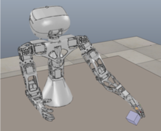
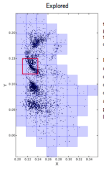

## Visualize the robot in a simulator

### Simulated Poppy Creatures

Simulated versions of all Poppy robots (Humanoid, Torso, and Ergo Jr) are available.

Connection with two main "simulators" were developed:
* using [V-REP](http://www.coppeliarobotics.com): a virtual robot experimentation platform
* using [a 3D web viewer](http://simu.poppy-project.org): lighter but without physics support

> **Caution** At the moment, only the Poppy Ergo Jr can be used in the web visualizer. If you want to simulate other creatures, you should use V-REP. Support for the other robots is planned but not expected in the near future.

We think simulation can be a powerful tool. It allows the development and test of programs without the need of having a real robot. This is especially useful:

* To discover and try the robot possibilities without having to spend money.
* In a context where multiple users share a robot. For instance in a classroom where each group can work using the simulator and validate their program on a real robot.
* To design and run complex and time consuming experiments.

We try to make the **switch from a simulated Poppy robot to the real one as transparent and as simple as possible**. Most of the programming documentation is actually valid for both simulated and real robots. The chapter *[From simulation to real robot](#from-simulation-to-real-robot)* will guide you in the few steps to transform your program running in simulation to one working with a real robot.

> **Caution** If you want to use Poppy robots using a simulator you will have to install some of the poppy libraries locally on your computer.

### Install the needed software 

While the physical robots come with libraries pre-installed, they are not integrated in the simulators. More details of what you will have to do is given in the [section below](#install-the-needed-software). You will also not have access to the robot web interface. You will have to manually launch the different services to start programming your robot (the Jupyter server for Python notebooks, or use the Snap_!_ server).

> **Info** We are hoping to have a one-click app for Windows/Mac/Linux with everything setup at some point. Yet, this is not expected to be available in the near future.

To start controlling a simulated Poppy robots, either using V-REP or the web visualizer, you will need:
* To have a working Python, we strongly recommend to use the [Anaconda Python distribution](https://www.continuum.io/downloads). It works with any version >=2.7 or >=3.4. Prefer Python 2.7 if you can, as it is the version we used.
* To install the Poppy libraries: pypot and the library corresponding to your creature (e.g. poppy-ergo-jr).

> **Note** details about those steps can be found in section *[Install everything locally for using a simulator](#TODO)*.

### Using V-REP

[V-REP](http://www.coppeliarobotics.com/downloads.html) is a well known and powerful robot simulator. It is widely used for research and educational purposes. Moreover, it is available for free under an educational license. It can be download from [their website](http://www.coppeliarobotics.com/downloads.html) (works under Mac OS, Windows and GNU/Linux).

*It is important to note that as V-REP is simulating the whole physics and rendering of the robot, it may be slow if you do not have a powerful computer (especially the GPU card).*

All main Poppy robots are available in V-REP:
* Poppy Humanoid
* Poppy Torso
* Poppy Ergo Jr

V-REP can be used to learn how to control motors, get information from sensors but also to interact with the simulated environment. It can be controlled using Python, Snap_!_ or through the REST API. Here, are some examples of what the community has already been doing with it:
* A pedagogical activity to discover the different motor of your robot and how they can be controlled.
* A scientific experiment, where a Poppy Torso is learning how to push a cube on a table in front of it

*Note: Even if we try, to reproduce the robot behaviour and functioning, some differences remain. In particular, if you make a robot walk in simulation that does not necessarily mean that it will walk in the real world (and vice-versa).*

### Using the web visualizer
