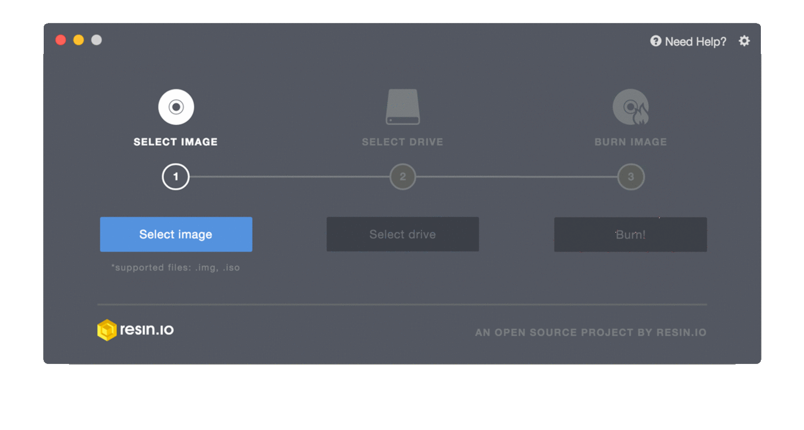

# Setup your Poppy Board

>**Note** This chapter is only for people who want to control a tangible robot. If you intend to control a simulated robot on your computer, look at the [simulation install path](README.md#you-want-to-try-poppy-robots-in-a-simulator-or-in-a-web-viewer).

Poppy creatures are controlled by a small embedded computer: a Raspberry Pi or an Odroid board.

The operating system of this computer is hosted on a SD card (you can also use an MMC for the Odroid).

You may be in two kind of cases:
- You already have a SD card with the Poppy operating system (provided by one of the Poppy distributors for example). You're ready to go to the [assembly section](../assembly-guides/README.md).
- You have an empty SD-card, so you have to [download](#download-the-image) and [write](#write-an-image-to-the-sd-card) the operating system on the SD card .

> **Info** The Poppy creatures operating system use a GNU/Linux distribution, but you won't have to any knowledges on Linux to install the image on the Raspberry Pi.
> You will only need a computer with a SD card reader/writer to write the image on the SD card.

## Download the image

You have to choose the image (file in *.img.zip) to download depending on your Poppy creature and the targeted board:

* [Poppy ErgoJr](https://github.com/poppy-project/poppy-ergo-jr/releases)
* [Poppy Torso](https://github.com/poppy-project/poppy-torso/releases)
* [Poppy Humanoid](https://github.com/poppy-project/poppy-humanoid/releases/)

The .zip file you have downloaded need to be unzipped to get the image file for writing to your SD card.

## Write an image to the SD card

With the image file corresponding to your Poppy creature, you need to use an image writing tool to install it on your SD card.
First unzip the image you have previously downloaded.

### Burn the image with etcher (GUI software)

Download and install [etcher](http://etcher.io/). It works for Windows, OSX, and GNU/Linux operating systems.

Select the unzipped image, select the SD-card or MMC drive, press the *burn* button, and wait until it is done. 

Now you are ready to [assemble your robot](../assembly-guides/README.md) !

### Burn the image with `dd` (CLI software)

> **Warning** This method works only for GNU/Linux and OSX operating systems, and is not recommended if you don't understand what you do.

- Run `df -h` to see what devices are currently mounted.
- If your computer has a slot for SD cards, insert the card. If not, insert the card into an SD card reader, then connect the reader to your computer.
- The new device that has appeared is your SD card. The left column gives the device name of your SD card; it will be listed as something like `/dev/mmcblk0p1` or `/dev/sdd1`. The last part (`p1` or `1` respectively) is the partition number but you want to write to the whole SD card, not just one partition. Therefore you need to remove that part from the name (getting, for example, `/dev/mmcblk0` or `/dev/sdd`) as the device for the whole SD card. Note that the SD card can show up more than once in the output of df; it will do this if you have previously written a Raspberry Pi image to this SD card, because the Raspberry Pi SD images have more than one partition.

- Run `umount /dev/sdd1`, replacing `sdd1` with the device name of your SD card (including the partition number).

- In the terminal, write the image to the card with the command below, making sure you replace the input file `if=` argument with the path to your `.img` file, and the `/dev/sdd` in the output file `of=` argument with the right device name.

> **Caution** You will lose all data on your hard drive if you provide the device name of another running partition. 

Make sure the device name is the name of the whole SD card as described above, not just a partition of it; for example `sdd`, not `sdds1` or `sddp1`; or `mmcblk0`, not `mmcblk0p1`.very important, as 

If you are running a GNU/Linux OS: 
```bash
sudo dd bs=4M if=poppy-ergojr.img of=/dev/mmcblk0
```
If you are running OSX or another BSD based OS:

```bash
sudo dd bs=4m if=poppy-ergojr.img of=/dev/disks1
``` 

> **Info** The `dd` command does not give any information of its progress and so may appear to have frozen; it > could take more than five minutes to finish writing to the card. To see the progress of the copy operation you can run `sudo pkill -USR1 -n -x dd` in another terminal.

- Run `sync`; this will ensure the write cache is flushed and that it is safe to unmount your SD card.

- Remove the SD card from the card reader.


Now you are ready to [assemble your robot](../assembly-guides/README.md)!