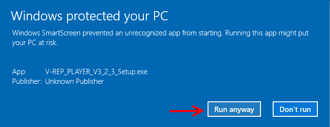
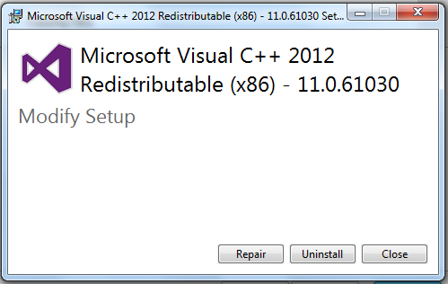
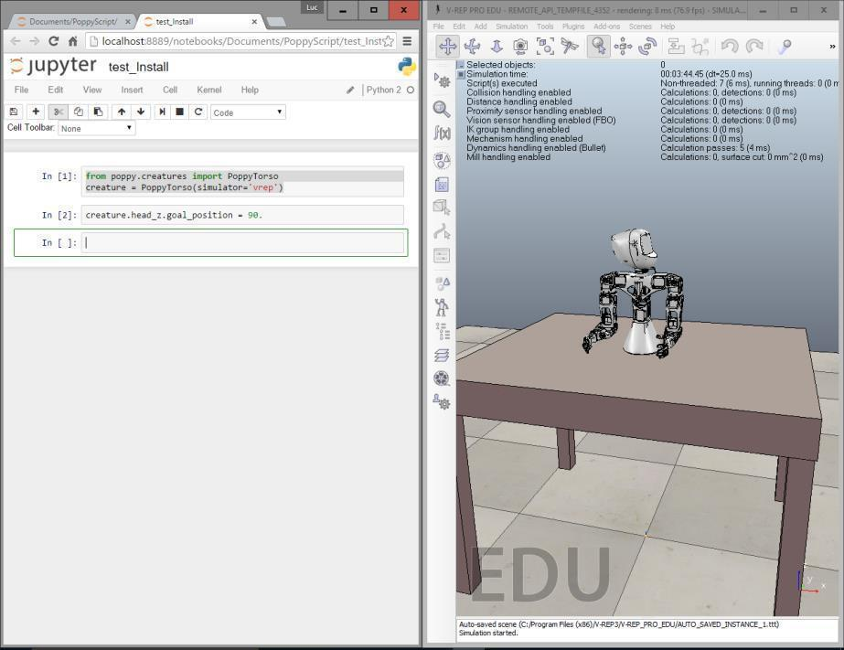

# Install the robotic simulator V-REP
> **Info** You need to install [Poppy softwares](install-poppy-softwares.md) before installing the V-REP simulator.

[V-REP](http://www.coppeliarobotics.com/downloads.html) is an efficient robotic simulator mainly open source (GNU GPL), which is distributed under a free license for educational entities and have a commercial license for other purposes.
There is also an *PRO EVAL* version which limit the right to backup. As you don't need to backup the scene to use V-REP with pypot (the Python library made for Poppy creatures), we suggest you to install this version to not worry about copyright infringement.
If you want to modify the V-REP scene for adding or customizing a Poppy creature, you will have to use the PRO or the EDU version (look at the [educational license](http://www.coppeliarobotics.com/licensing-plugin-edu.html)).


## Install V-REP on Windows

[Download V-REP](http://www.coppeliarobotics.com/downloads.html) PRO EVAL or EDU (if you are an educational entity).
As V-REP is not signed, you will have to pass the Windows SmartScreen (on Windows 10) popup to begin the installation.


During the installation, make sure to install *Visual C++ Redistributable 2010* and *Visual C++ Redistributable 2012*.


Even if you already have *Visual C++ Redistributable 2010* or *Visual C++ Redistributable 2012*, it is advised to "repair" them (it is a re-installation process).



**After the installation you can [test if V-REP works well](#test-your-installation)**.

## Install on MAC OSX
<!-- TODO -->
> **Caution** This paragraph is not currently written. Your help is welcome to fulfill it !

## Install on GNU/Linux
<!-- TODO -->
> **Caution** This paragraph is not currently written. Your help is welcome to fulfill it !

## Test your installation

Open V-REP with a double click on the desktop icon.
Open the prompt of your Python Distribution (called *Anaconda Prompt* for Anaconda) or the *Command Prompt* of Windows, type and press Enter to execute the command below:

```bash
poppy-services --snap --vrep --no-browser poppy-torso`
```
After a few seconds, you will have an error like the picture below in your Command prompt.


If you switch to the V-REP window, a popup appeared to inform you that the simulation use custom parameters. This popup block the communication to the Python API of V-REP. **You have to check the check-box "Do not show this message again" and press "Ok".**


Switch the the command prompt window. You will have to execute the last command (`poppy-services --snap --vrep --no-browser poppy-torso`) and click again to the V-REP popup (with the check-box checked). **This process will have to be done *three times* to make it works well!**

> **Info** To avoid retyping the same command again and again, you can simply press the up arrow key to call the last typed line.

When the setup of V-REP is ready, you can execute the last command without the "--no-browser" part.
```
poppy-services --snap --vrep poppy-torso
```

If you see a firewall popup like the picture below, be sure to check the "private network" check-box.


If everything works, a new tab have been opened on your default web-browser.
<!-- TODO: lien doc -->
You can program you robot in Snap_!_ or in Python.


