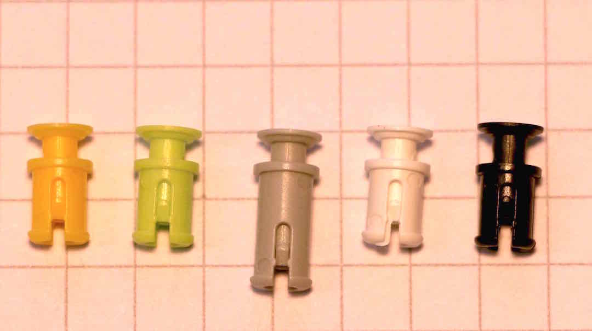
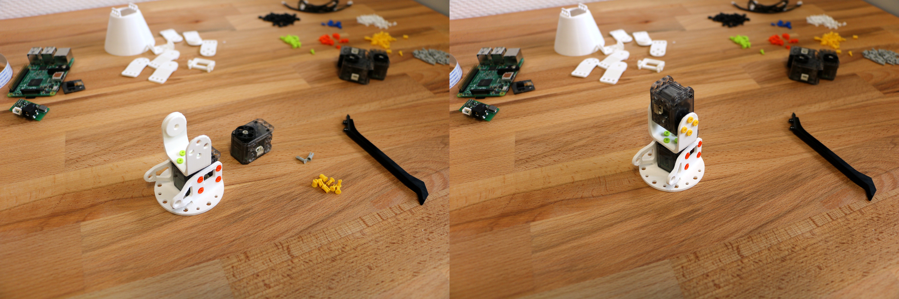
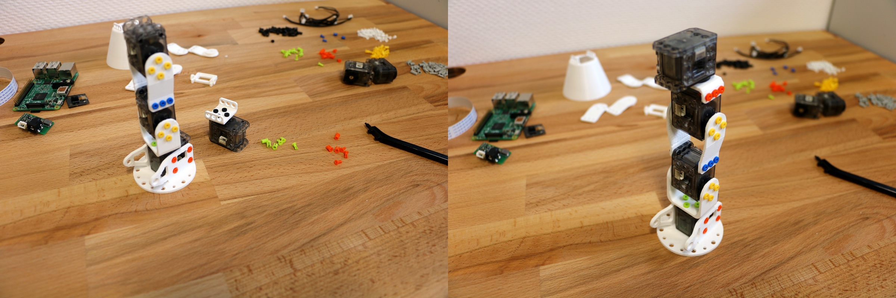
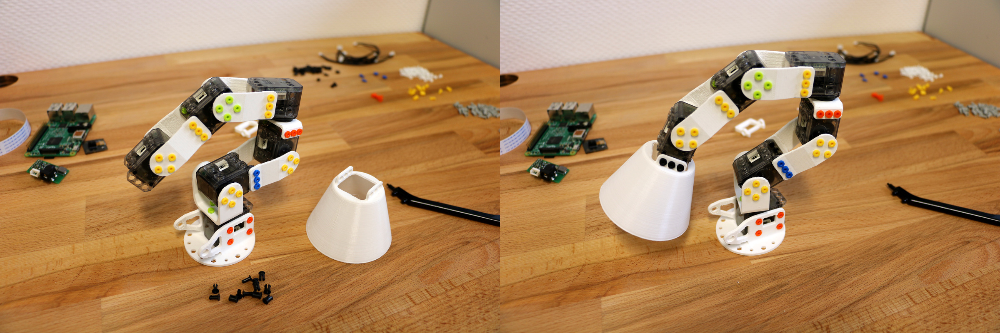

## Construction mécanique

### Avis et avertissements d'ordre général

<!-- TODO:
* picture rivet black vs grey
* ergo + wires
-->

* Vous pouvez assembler tous les rivets avant la construction.  Vous devez insérer la tige de la première partie dans le trou de la seconde. Vous pourrez ainsi les enlever facilement si nécessaire.


* Il y a deux types de rivets: les gris et les autres. Les rivets gris sont plus longs afin de pouvoir les insérer à travers l'axe du moteur, par le côté opposé aux palonniers d'assemblage.



* Utilisez l'outil OLLO pour pouvoir monter et démonter les rivets facilement.


* N'oubliez pas d'insérer les fils entre les moteurs quand vous construisez le robot ! Chaque moteur, mis à part le dernier de la chaîne, doit avoir deux fils : un connecté au moteur précédent et l'autre au moteur suivant (le sens de connexion n'a pas d'importance).


* **Alignez toujours le palonnier (la roue d'entrainement noire) avec le moteur avant de les assembler!** Sinon votre Poppy Ergo Jr aura l'air tout à fait bizarre...


* Toutes les palonniers moteur doivent être alignées sur **le côté gauche du robot**. C'est juste une convention mais elle définira l'orientation de vos moteurs.


## Guide pas à pas

### Configuration des moteurs (pour toutes les étapes)

Vous pouvez configurer les moteurs avant, pendant ou après l'assemblage mécanique mais il est hautement conseillé de configurer chaque moteur un par un dans l'ordre de construction :

* Configurer moteur m1
* Assembler la base et le moteur m1
* Configurer le moteur m2
* ...


> **Attention** Pour configurer les moteurs vous devez les connecter séparément un par un avec le Raspberry Pi. Si vous essayez de configurer un nouveau moteur alors qu'il est connecté avec le moteur précédent, cela ne fonctionnera pas.

Veuillez consulter le [chapitre configuration des moteurs](motor-configuration.md) pour plus d'informations.

### Etape 1
Tout d'abord, [configurez un moteur XL-320](motor-configuration.md) en tant que "m1".

Montez le moteur sur la base imprimée en 3D.


Pour se faire, préparez 8 petits rivets. Placez la première partie dans la seconde sans les mettre à l'intérieur du moteur. Ensuite, placez le moteur sur la base avec la palonnier faisant face au côté le plus ouvert. Utilisez l'outil OLLO pour attraper le rivet entre la première et seconde partie puis insérez le rivet dans un des trous d'assemblage. Une fois le rivet en place, verrouillez-le en poussant la partie 1 du rivet dans la partie 2.


### Etape 2
Configurez le second moteur (son nom est "m2"), avec la commande suivante dans un terminal Poppy:
```bash
poppy-configure ergo-jr m2
```

Montez la pièce en forme de *long U*. Attention avec l'orientation du U, le palonnier doit être orientée sur la gauche.
Montez le moteur "m2" au sommet de la construction.




### Etape 3
Configurez le moteur "m3".

Montez la pièce "palonnier à palonnier" et la pièce "palonnier à côté" sur le moteur "m2" et montez "m3" au sommet de la construction.


### Etape 4

Configurez le moteur "m4".

Montez une pièce en "U court" sur le moteur 4.


Montez le moteur "m4" et la pièce en "U court" qui y figure au sommet de la construction. Le nez du moteur devrait être sur l'autre côté de la base.


### Etape 5

Configurez le moteur "m5".

Montez la pièce "palonnier à palonnier" et la pièce "palonnier à côté" sur le moteur "m4", et montez "m5" au sommet de la construction.


### Etape 6 - l'outil de votre choix
Configurez le moteur "m6".

Pour achever votre Ergo Jr, vous devez ajouter un outil à son extrémité. Choisissez un outil en fonction de ce que vous souhaitez faire.

> **Note** Les outils peuvent être facilement et rapidement changer vous pouvez donc l'adapter aux différentes activités.

#### Abat-jour ou porte-stylo

Montez la pièce "palonnier à palonnier" et la pièce "palonnier à côté" sur le moteur "m5", et montez "m6" au sommet de la construction.


Vous pouvez monter le porte-stylo ou l'abat-jour sur le moteur "m6".



#### Pince
Montez l'[*attache de la pince*](https://github.com/poppy-project/poppy-ergo-jr/blob/master/hardware/STL/tools/gripper-fixation.stl) entre les moteurs "m5" et "m6".

Montez la partie *Fixe de pince* et partie *Rotative de pince* sur le moteur "m6".
<!-- TODO closed picture of gripper-->


### Etape 7 - electronics
Monter la partie support caméra sur la base. Attacher la caméra Raspberry Pi et bouger le câble caméra Flex entre le moteur "m1" et la base.


Pour connecter le câble Flex de la caméra sur le Raspberry Pi, vous devez:

* Ouvrir le connecteur caméra en tirant l'attache vers le haut.
* Vous assurer que la face des connecteurs du câble Flex est dos au port Ethernet.
* Pousser le flex dans le port et repoussez l'attache plastique du port caméra vers le bas.

<!-- TODO: add a closed picture of camera fix-->
**Fils moteurs:**

Si ca n'est pas déjà le cas, vous pouvez connecter tous les fils moteurs. Chaque moteur a deux connecteurs mais il n'y pas ni entrée ni sortie, vous devez simplement créer une chaîne de moteurs.
Le premier moteur est connecté à la carte d'extension PIXL et au second moteur; le dernier moteur est lié seulement au moteur précédent, et tous les autres sont connectés au moteur précédent.

<!-- TODO picture of OLLO + base rivets -->
> **Information**  Les connecteurs du moteur "m1" (sur la base) sont un peu difficiles à connecteur, vous pouvez utiliser l'outil OLLO pour vous aider.


### Etape 8 - connectez votre ergo-jr au
Montez votre ergo-jr sur le *disque de support en bois*.

Montez votre Raspberry Pi sur le disque de support, et utilisez une vis 4 x M2.5x6mm pour l'arrimer.
<!-- TODO: picture of disk fixation -->

### C'est Fini


Prenez maintenant un verre de votre [boisson préférée](https://www.flickr.com/photos/poppy-project/16488256337/) et détendez-vous.
