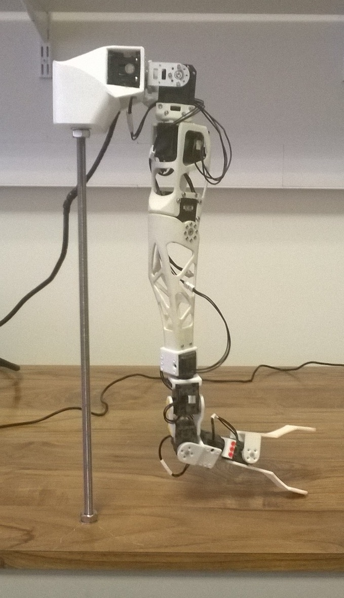
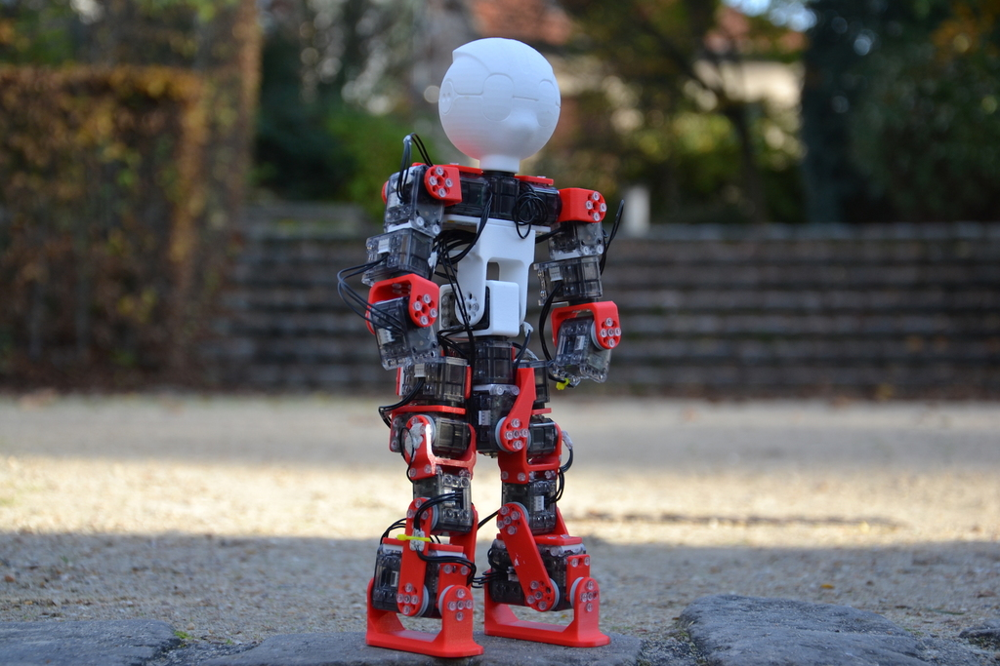

# Démarrer

Le [Projet Poppy](https://www.poppy-project.org/) est un projet sous licence libre pour la création, l'utilisation et le partage de robots interactifs réalisés par impression 3D. Il rassemble une communauté inter-disciplinaire de débutants et d'experts, de scientifiques, d'enseignants, développeurs et artistes. Ils partagent une vision: les robots sont de puissants outils d'apprentissage, de création et de collaboration afin d'améliorer le projet. Ils developpent de nouveaux comportements robotiques, créent des contenus pédagogiques, conçoivent des performances artistiques, améliorent le logiciel ou même créent de nouveaux robots.

La [Communauté Poppy](https://forum.poppy-project.org/) développe des créations robotiques faciles à construire, à personnaliser et à déployer. Nous promouvons  les licences libres en partageant la matériel et le logiciel. Une plateforme Web associée permet à la communauté de partager ses expériences et de contribuer à son amélioration.

Pour faciliter ces échanges, deux supports sont disponibles :

* [Le forum poppy-project](https://forum.poppy-project.org/) pour obtenir de l'aide, discuter et échanger des idées.

* [GitHub](https://github.com/poppy-project) pour soumettre vos contributions.

Toutes les sources du projet Poppy \(logicielles et matérielles\) sont disponibles sur [GitHub](https://github.com/poppy-project).

Le projet Poppy a initialement été conçu au laboratoire [Inria Flowers](http://www.inria.fr/equipes/flowers/).

## Les créatures Poppy

Les créatures Poppy sont des robots sous licence libre, disponibles au téléchargement et pour être modifiés \([Licence Creative Commons avec attribution](http://creativecommons.org/licenses/by-sa/4.0/) pour le matériel et la licence [GPLv3](http://www.gnu.org/licenses/gpl-3.0.en.html) pour le logiciel\). Elles ont été conçues avec ces mêmes principes directeurs.

Toutes les créatures Poppy:

* sont faites à partir de pièces imprimables en 3D et de moteurs Dynamixel,
* utilisent une carte d'extension pour le contrôle \(un Raspberry Pi 2 ou Odroid pour les versions plus anciennes\),
* sont basées sur une bibliothèque Python, [pypot](../software-libraries/pypot.md), qui permet le contrôle des servomoteurs Dynamixel de manière simplifiée,
* ont une version de simulation disponible \(basée sur [V-REP](http://www.coppeliarobotics.com)\),
* peuvent être controlées en utilisant un langage de programmation visuel \([Snap!](http://snap.berkeley.edu) une variation de Scratch\) et un langage textuel [Python](https://www.python.org). Elles sont aussi programmables par l'intermédiaire d'une API REST, ce qui permet de les contrôler à partir d'autre langages de programmation,
* viennent avec la documentation associée, des tutoriels, exemples et activités pédagogiques.

Elles peuvent être utilisées telles quelles, ou modifiées pour explorer de nouvelles formes, l'ajout de senseurs, etc...

Pour obtenir votre propre robot Poppy, vous pouvez soit :

* Vous procurer toutes les pièces vous-même en suivant la liste ci-dessous.
* Acheter un kit de robotique Poppy complet auprès de notre [détaillant officiel](http://www.generationrobots.com/en/279-poppy-opensource-robotics-platform).

### Poppy Ergo Jr

Le robot Poppy Ergo Jr est un petit bras robotique à cout modéré qui possède six degré de mouvements. Il est fait de 6 moteurs au prix abordable \(des servos XL-320 Dynamixel\) ainsi que de parties simples et imprimables en 3D.

Les pièces 3D ont été conçues pour être aisément imprimée sur un imprimante 3D courante. Les moteurs coûtent environ 20€ chacun. La carte électronique de contrôle est simple. Cela facilite la connexion de senseurs supplémentaires et est donc adapté à des objectifs pédagogiques.

Vous pouvez choisir parmi les trois outils pour équiper l'extrêmité de son bras :

* Une lampe.

* Une pince.

* Un porte-stylo.

Les rivets employés rendent le montage et démontage des outils simples. Vous pouvez les adapter en fonction de l'activité choisie.

Le Ergo Poppy Jr est idéal pour débuter à manipuler des robots et apprendre la robotique sans difficultés. Il est simple à assembler, contrôler et d'un coût réduit.

Vous pouvez obtenir les pièces vous-mêmes en suivant la [liste des matériaux](https://github.com/poppy-project/poppy-ergo-jr/blob/master/doc/bom.md) \(LDM\) et imprimer les [pièces 3D](https://github.com/poppy-project/poppy-ergo-jr/releases/) disponibles au format STL.

Pour plus d'informations, vérifiez le [guide d'assemblage de l'Ergo Jr](../assembly-guides/ergo-jr/README.md).

### L'Humanoïde Poppy

Il s'agit d'un robot humanoïde à 25 degrés de liberté possédant une colonne vertébrale complètement motorisée. Il est utilisé pour l'éducation, la recherche \(marche, interactions entre humains et robots\) ou les arts \(danses, performances\). Du simple bras à l'humanoïde complet, cette plateforme est activement utilisée dans les laboratoires, les écoles d'ingénieur, les FabLabs, et les projets artistiques.

Vous pouvez obtenir les pièces vous-mêmes en suivant la [liste des matériaux](https://github.com/poppy-project/poppy-humanoid/blob/master/hardware/doc/BOM.md) \(LDM\) et imprimer les [pièces 3D](https://github.com/poppy-project/poppy-humanoid/releases/tag/hardware_1.0.1/) disponibles au formats STL, STEP et Solidworks 2014.

### Le Torse Poppy

Il s'agit de la partie supérieure de l'Humanoïde Poppy \(13 degrés de liberté\). Le Torse Poppy est donc plus abordable que l'Humanoïde Poppy complet. Cela en fait une solution plus appropriée aux contextes éducatifs et associatifs. Le Torse Poppy peut être un bon média pour apprendre la science, la technologie, l'ingénieurie et les mathématiques \(STEM\).

Vous pouvez obtenir les pièces vous-mêmes en suivant la [liste des matériaux](https://github.com/poppy-project/poppy-torso/blob/master/hardware/doc/BOM.md). Les [modèles 3D](https://github.com/poppy-project/poppy-humanoid/releases/tag/hardware_1.0.1/) pour les pièces sont identiques à celles de l'Humanoïde Poppy, sans les jambes et avec un [support à ventouse supplémentaire](https://github.com/poppy-project/robot-support-toolbox/).

###  Autres Créatures Poppy

Un aspect clef du projet Poppy est de stimuler la créativité et l'expérimentation autour de la robotique. Nous essayons de fournir tous les outils requis pour la conception de nouveaux robots basés sur les mêmes briques technologiques. Plusieurs créatures sont en cours de développement au sein de la communauté. Certaines d'entre elles vous sont présentées ci-dessous.

#### Le Bras Droit Poppy \(en construction\)

Le Bras Droit Poppy est une créature basée sur le bras droit de l'Humanoïde Poppy, avec 3 moteurs XL-320 additionnels à son extrémité afin d'améliorer la portée et l'agilité du bras. Il utilise le même outil pince employé par l'Ergo Jr, conçu pour saisir des objets simples.

Le projet a été réalisé pendant le stage de [Joel Ortiz Sosa](https://github.com/joelortizsosa) au laboratoire Inria Flowers. Plus d'informations et les fichiers sources sont disponibles dans le [dépot Github correspondant](https://github.com/poppy-project/poppy-6dof-right-arm).

#### Humanoïdes plus petits et abordables

##### Heol

Heol - qui signifie "soleil" en Breton - est un humanoïde de 34cm de hauteur produit par l'association [Heol robotique](http://heol.io/). Il est composé de 23 moteurs, toutes les autres pièces sont imprimées en 3D. Il dépend aussi de la bibliothèque Pypot pour ses mouvements.

Le but d'Heol est de faire naître un sourire sur le visage des enfants. Il peut être un outil éducatif en devenant un support d'apprentissage de la programmation et de la conception mécanique.

Sa participation à la RoboCup \(Tournoi international de football pour robots\) est aussi envisagée.

##### [Poppyrate](http://www.poppyrate.com/)

Il s'agit d'un robot basé sur l'Humanoïde Poppy. Il vise le développement d'une version moins chère grâce à sa taille réduite et l'usage de moteurs moins chers. La réduction de taille le rend aussi plus facile à imprimer sur une imprimante 3D courante. D'autres buts sont de le rendre aussi mobile et personnalisable que possible tant en conservant la compatibilité avec le logiciel Poppy. 

Poppyrate peut être vendu en kit \(avec ou sans les parties 3D imprimées\). Il a été conçu par la société ZeCloud.

Pour plus d'informations, consultez le [site Web](http://www.poppyrate.com/) - [Twitter](https://twitter.com/poppyratproject) - [Facebook](https://www.facebook.com/Poppyrate/)!

